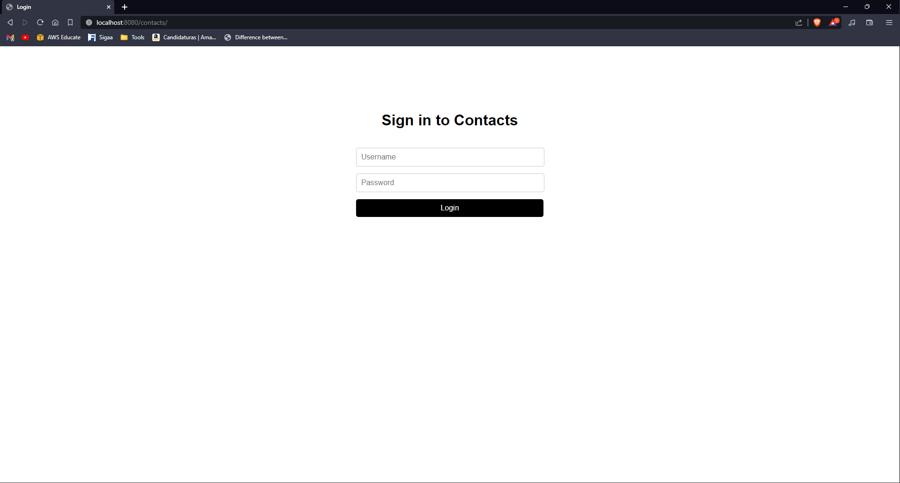
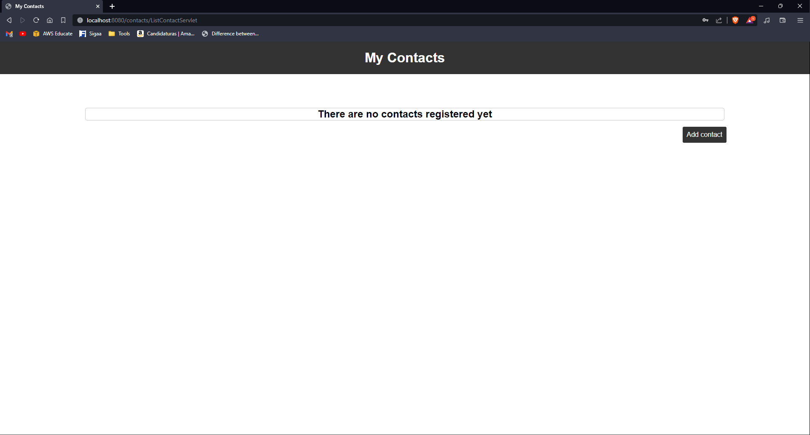
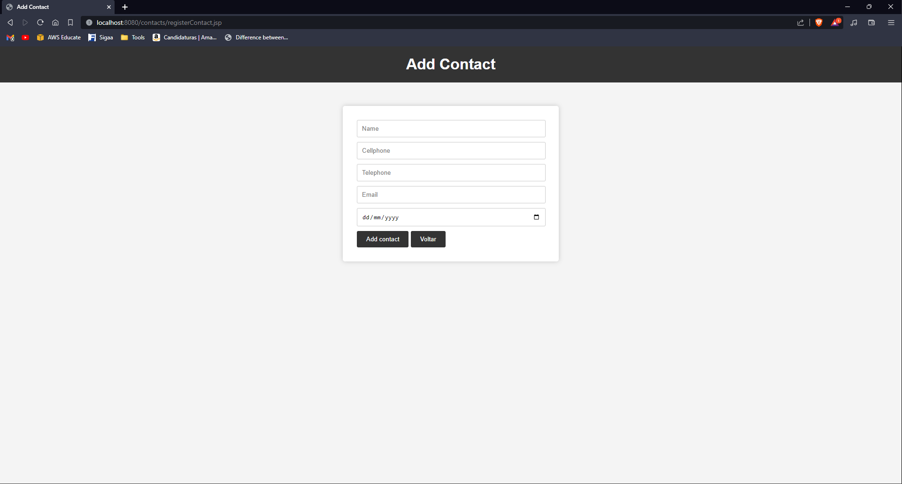
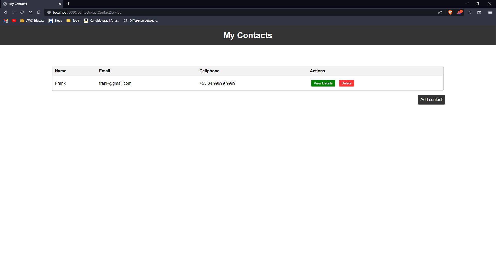
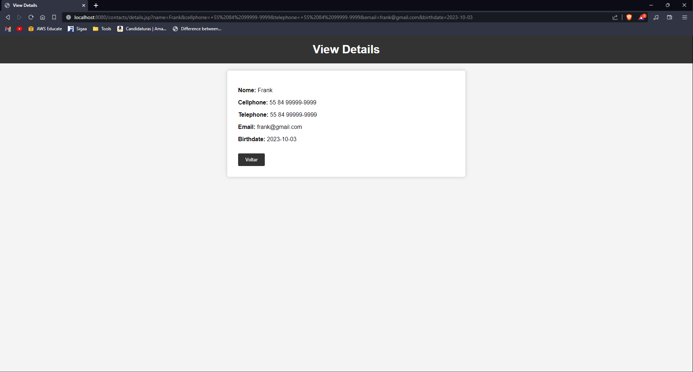
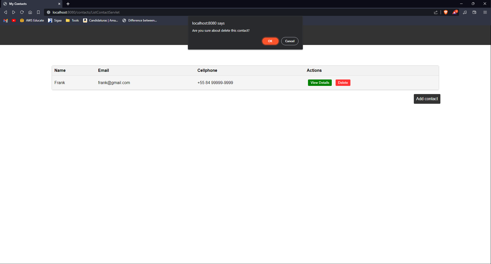

## Contacts JSP

This code is for a save contacts, written in Java Server Pages (JSP). The purpose of this code is to display the schedule of a school in a web page. The code is written in Java Server Pages (JSP) and uses the Java Servlet API, JSTL, Java EE 21 LTE and Apache Tomcat 10.0.2.

### Design Patterns

- MVC (Model-View-Controller)
- DAO (Data Access Object)
- Singleton
- Builder

### Libraries

The necessary libraries are imported using the following code:

- Java Servlet API
- JSTL
- Java EE 21 LTE
- Apache Tomcat 10.0.2

### UI/UX

The user interface (UI) and user experience (UX) are designed using the following technologies:

- HTML5
- CSS3
- JavaScript

|    |
| :---------------------------: |
|         _Login Page_          |
|  |
|             :--:              |
|        _Contact List_         |
|   |
|             :--:              |
|         _Add Contact_         |
|    |
|             :--:              |
|        _Contact List_         |
|    |
|             :--:              |
|           _Details_           |
|    |
|             :--:              |
|       _Delete Contact_        |

### How to run the code in your computer using Eclipse IDE and Apache Tomcat 10.0.2 (or newer) server (localhost)

1. Download the code from this repository.
2. Open Eclipse IDE.
3. Click on File > Open Projects from File System.
4. Click on Directory and select the folder where you downloaded the code.
5. Click on Finish.
6. Click on Run > Run Configurations.
7. Click on Apache Tomcat > Tomcat v10.0 Server at localhost.
8. Click on the tab Classpath.
9. Click on Add External JARs.
10. Select the JARs from the folder where you downloaded the code.
11. Click on Apply and Close.
12. Click on Run > Run Configurations.
13. Click on Apache Tomcat > Tomcat v10.0 Server at localhost.
14. Click on the tab Server Locations.
15. Select the option Use Tomcat installation (takes control of Tomcat installation).
16. Click on Apply and Close.
17. Click on Run > Run Configurations.
18. Click on Apache Tomcat > Tomcat v10.0 Server at localhost.
19. Click on Run.
20. Open your browser and type the following URL: http://localhost:8080/contacts-jsp/

### Author

This code is written by Frank Laércio.

### License

This project is licensed under the MIT License rules - see the LICENSE.md file for more details.
